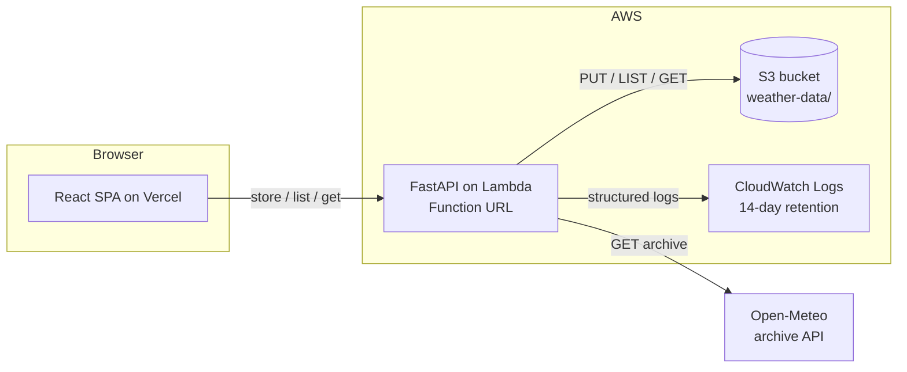

# ClymLens

A small full-stack **weather explorer**. Pick a location and date range, fetch historical
daily weather from the [Open-Meteo](https://open-meteo.com/) archive API, store the raw JSON
in Amazon S3, then browse the stored datasets and inspect each one — temperature trend chart
plus a paginated table of daily observations.

Built for the InRisk Labs full-stack case study.

| | Stack | Hosting |
|---|---|---|
| **Frontend** | React 18 · TypeScript · Tailwind CSS v4 · Vite · Recharts · Leaflet | Vercel |
| **Backend** | Python 3.12 · FastAPI · httpx · boto3 | AWS Lambda (Function URL) |
| **Storage** | Amazon S3 — one raw JSON object per fetch | — |
| **Weather** | Open-Meteo Historical Archive API (public, keyless) | — |

## Live demo

| | URL | Last verified live |
|---|---|---|
| Dashboard | **https://clymlens.vercel.app** | 2026-09-11 |
| API | `https://vnhkz43xkc4t6mefvzrnbhfyvi0qmwyd.lambda-url.ap-south-1.on.aws` | 2026-09-11 |

Health check: `curl https://vnhkz43xkc4t6mefvzrnbhfyvi0qmwyd.lambda-url.ap-south-1.on.aws/health`

The backend runs on AWS Lambda (region `ap-south-1`) behind a Lambda Function URL. It reads
and writes S3 **using its IAM execution role — no access keys anywhere**. If the API is cold
the first request takes ~2–3 s.

Both tiers run on perpetually-free infrastructure (Lambda's free tier never expires; Vercel
Hobby static hosting doesn't sleep or get torn down), so there's no scheduled downtime to plan
around — but if a future check ever finds either URL down, redeploy with:

```bash
# backend (from backend/, once AWS creds are configured — see DEPLOY.md)
sam build --use-container && sam deploy

# frontend — push to main with VITE_API_BASE_URL set on Vercel; it redeploys on push
```

> Full deployment steps and redeploy instructions: [`backend/DEPLOY.md`](backend/DEPLOY.md).

---

## The workflow

```
location + date range
      │  POST /store-weather-data
      ▼
fetch from Open-Meteo ──▶ store raw JSON in S3 ──▶ returns the file name
      │
      ▼
browse stored datasets (GET /list-weather-files)
      │  select one
      ▼
load its content (GET /weather-file-content/{file})
      │
      ▼
temperature chart  +  paginated daily table   ← all rendered from the stored file
```

The dashboard never calls Open-Meteo directly. Every visualization reads a **stored** S3
object through the backend, and an identical request within a short window reuses the
existing object instead of calling Open-Meteo again.

---

## Architecture



**Responsibilities**

| Layer | Owns |
|---|---|
| React SPA | Input + client-side pre-validation, workspace state (file list, selection, content), all loading/error/empty/success UI, chart + table rendering. No direct Open-Meteo calls. |
| FastAPI (Lambda) | Request validation, Open-Meteo integration, S3 read/write/list, de-duplication, per-IP rate limiting, CORS, structured logging. All business logic. |
| S3 | The only persistence. One JSON object per fetch. Private bucket (Block Public Access on, SSE-S3), managed outside the stack; a 90-day lifecycle rule keeps it bounded. |
| IAM role | Lambda execution role with least-privilege S3 access scoped to the `weather-data/` prefix (`GetObject`/`PutObject` + prefix-conditioned `ListBucket`). No access keys in the deployed app. |

**Local vs deployed**

| | Local | Deployed |
|---|---|---|
| Backend | `uvicorn app.main:app` on `:8000` | Lambda via Mangum, invoked through a Function URL |
| S3 | real AWS **or** a local fake (`moto` server / LocalStack) via `S3_ENDPOINT_URL` | real AWS S3 |
| Config | `backend/.env` | Lambda environment variables (set by the SAM template) |
| Frontend | `vite` dev server on `:5173` | static build on Vercel |
| CORS origin | `http://localhost:5173` | the Vercel production URL |

---

## Repository layout

```
backend/
  app/
    main.py            app factory, CORS, lifespan
    config.py          settings from environment
    lambda_handler.py  Mangum entrypoint
    api/               routes + dependency providers
    models/schemas.py  request/response models + validation
    services/
      weather.py       Open-Meteo client (retry, error mapping)
      storage.py       S3 read / write / list / dedup
      naming.py        object name build + path-safety
    errors.py          error types → HTTP status mapping
    exception_handlers.py   unified { "status": "error", "message": ... }
    rate_limit.py      fixed-window per-IP limiter
    middleware.py      body-size guard + request logging
  tests/               pytest (moto for S3, respx for Open-Meteo)
  template.yaml        AWS SAM
  DEPLOY.md            deployment runbook
frontend/
  src/
    api/               typed client + service functions
    context/           WorkspaceContext (files/selection/content), QueryDraftContext
                        (shared draft between the main panel and sidebar quick-fetch),
                        SidebarUIContext (collapse state), ToastContext (toasts)
    hooks/             useAsync (idle/loading/success/error), useDebouncedValue
    lib/               validation, normalization, formatting, stats, geocoding, country flags
    components/
      layout/          AppShell (top bar), CollapsibleSidebar, BrandMark
      query/           city search, map picker, coordinate/date fields, main fetch panel
      datasets/        stored-dataset list
      workspace/       chart + observations table for the selected dataset
      onboarding/      first-visit guided tour (localStorage-persisted, replayable)
      ui/              shared primitives (Button, Panel, Modal, Alert, Tooltip, ...)
docs/DESIGN.md         detailed internal design spec (git-ignored, not published)
```

---

## API reference

Base URL: the Lambda Function URL (deployed) or `http://localhost:8000` (local).

### `POST /store-weather-data`

```jsonc
// request
{ "latitude": 19.076, "longitude": 72.8777, "start_date": "2024-06-01", "end_date": "2024-06-10" }

// 200
{ "status": "ok", "file": "weather_19.0760_72.8777_2024-06-01_2024-06-10_20260910T101500Z.json" }
// 200 when an existing fresh object was reused
{ "status": "ok", "file": "weather_...json", "cached": true }
```

Validates the body, checks S3 for a recent identical dataset, otherwise calls Open-Meteo
(`temperature_2m_max`, `temperature_2m_min`, `apparent_temperature_max`,
`apparent_temperature_min`, `temperature_2m_mean`, `timezone=UTC`) and writes the **raw**
response bytes to S3.

### `GET /list-weather-files?limit=200`

```jsonc
{ "files": [ { "name": "weather_...json", "size": 24187, "created_at": "2026-09-10T10:15:00Z" } ] }
```

Objects under the `weather-data/` prefix, newest first, via `list_objects_v2` (no full-bucket
scan). `limit` is 1–1000 (default 200). Empty bucket → `{ "files": [] }`.

### `GET /weather-file-content/{file}`

Returns the stored Open-Meteo JSON **verbatim**. The `{file}` segment must match the exact
name pattern; anything else (path traversal, wrong shape, missing object) →

```jsonc
// 404
{ "status": "error", "message": "not found" }
```

### `GET /health`

```jsonc
{ "status": "ok", "env": "production", "time": "2026-09-10T10:15:00Z" }
```

### Errors & status codes

Every error response is `{ "status": "error", "message": "<human readable>" }`.

| Code | When |
|---|---|
| `400` | invalid body/query (FastAPI's 422 is remapped to 400) |
| `404` | missing or invalid file identifier |
| `429` | per-IP rate limit exceeded (`Retry-After` header) |
| `502` | Open-Meteo returned an error or an unexpected payload |
| `504` | Open-Meteo timed out |
| `500` | S3 failure or an unexpected error |

---

## Data model

**S3 object key:** `weather-data/weather_<lat>_<lon>_<start>_<end>_<timestamp>.json`

- `lat` / `lon` — fixed to 4 decimals, sign preserved (`19.0760`, `-72.8777`). Deterministic,
  which also makes the de-duplication key stable (`19.076` and `19.0760` collide).
- `start` / `end` — `YYYY-MM-DD`.
- `timestamp` — compact UTC `YYYYMMDDTHHMMSSZ` (no colons; safe as a key and a filename).

**Object body:** the exact JSON Open-Meteo returned — `latitude`, `longitude`, `timezone`,
`elevation`, `daily_units`, and `daily.{time, temperature_2m_max, temperature_2m_min,
apparent_temperature_max, apparent_temperature_min, temperature_2m_mean}`.

---

## Validation & edge cases

| Rule | Result |
|---|---|
| `latitude` ∈ [-90, 90], `longitude` ∈ [-180, 180] | `400` naming the field |
| dates must be `YYYY-MM-DD`; `start ≤ end` | `400` |
| range ≤ **31 distinct days** (`end - start ≤ 30 days`) — see Assumptions | `400` |
| `end_date` not in the future (UTC) | `400` |
| unknown body fields / body > 4 KB | `400` |
| `{file}` with `/`, `\`, `..`, `%`, or wrong pattern | `404`, no S3 call |
| Open-Meteo all-`null` for the range | stored anyway; UI shows an empty state |
| Open-Meteo error / non-JSON / timeout | `502` / `504` |
| duplicate request within `DEDUP_TTL_MINUTES` | existing file returned, no upstream call |
| table page past the end / page size change | clamped / resets to page 1 |

---

## Local development

### Prerequisites

- Python 3.12+ and `pip`
- Node.js 22+ and `npm`
- Nothing else — a local S3 fake (`moto`) is included; no AWS account needed to run it

### One-time setup

```bash
cd backend
python -m venv .venv
.venv/Scripts/activate          # Windows  (macOS/Linux: source .venv/bin/activate)
pip install -r requirements-dev.txt
cp .env.example .env

cd ../frontend
npm install
echo "VITE_API_BASE_URL=http://localhost:8000" > .env.local
```

### Run everything (moto S3 + FastAPI + Vite, with hot reload)

```bash
bash scripts/dev.sh
```

Then open **http://localhost:5173**. Editing frontend files reloads the browser instantly;
editing backend files restarts the API. `Ctrl-C` stops all three. Stored datasets live in
`moto`'s memory and reset when you restart.

<details>
<summary>Or start the three processes yourself</summary>

```bash
# terminal 1 — fake S3
cd backend && .venv/Scripts/python -m moto.server -p 5000
# terminal 2 — API (bucket auto-created on startup)
cd backend && uvicorn app.main:app --reload --port 8000
# terminal 3 — dashboard
cd frontend && npm run dev
```
</details>

### Backend against real AWS S3 instead of the fake

To run locally against real AWS S3 instead of moto, set `ENV=production` and point `.env` at
a private bucket in `ap-south-1` (`S3_BUCKET=clymlens-weather-data-20260910`), leave
`S3_ENDPOINT_URL` empty, remove the dummy `AWS_*` keys, and provide credentials for an IAM
identity allowed to `ListBucket` / `GetObject` / `PutObject` on it (`aws configure` or `AWS_*`
env vars). The deployed Lambda uses this same production configuration through the SAM
template.

The form is pre-filled with a valid Mumbai query — click **Fetch & store** and the dataset
is fetched from the live Open-Meteo API, stored, and selected for inspection.

---

## Environment variables

**Backend** ([`backend/.env.example`](backend/.env.example))

| Var | Default | Notes |
|---|---|---|
| `ENV` | `local` | `local` \| `production` |
| `AWS_REGION` | `ap-south-1` | injected automatically on Lambda |
| `S3_BUCKET` | `clymlens-dev` (local) | required in production — startup raises `ValueError` if unset, so a missing bucket fails fast and loudly instead of surfacing as a vague runtime storage error |
| `S3_PREFIX` | `weather-data/` | |
| `S3_ENDPOINT_URL` | `http://localhost:5000` (local) | local fake S3 endpoint; production uses real AWS S3 |
| `OPEN_METEO_BASE_URL` | `https://archive-api.open-meteo.com/v1/archive` | |
| `HTTP_TIMEOUT_SECONDS` | `10` | |
| `DEDUP_TTL_MINUTES` | `360` | reuse an object newer than this |
| `RATE_LIMIT_PER_MINUTE` | `20` | per IP, on the store endpoint; `0` disables |
| `CORS_ORIGINS` | `http://localhost:5173` | comma-separated |
| `CORS_ORIGIN_REGEX` | — | optional, for preview URLs |
| `LOG_LEVEL` | `INFO` | |

**Frontend** ([`frontend/.env.example`](frontend/.env.example))

| Var | Notes |
|---|---|
| `VITE_API_BASE_URL` | backend base URL, no trailing slash |

---

## Testing

```bash
cd backend && pytest -q && ruff check . && black --check .
cd frontend && npm run typecheck && npm run lint && npm test && npm run build
```

- **Backend** — validation rules and boundaries, the Open-Meteo client (mocked with `respx`,
  incl. retry / 502 / 504 / malformed), the S3 layer (mocked with `moto`, incl. dedup and
  path-safety), all three endpoints, rate limiting.
- **Frontend** — the API client's error normalization, the Open-Meteo→rows normalizer, the
  query validator, the query form, the dataset browser, table pagination, and a mocked
  end-to-end flow (fetch → store → auto-select → visualize, plus the 404 path).

CI (`.github/workflows/ci.yml`) runs both suites on every push and pull request.

---

## Deployment

Full runbook: [`backend/DEPLOY.md`](backend/DEPLOY.md). In short:

1. **Backend (first time only)** — `cd backend && sam build --use-container && sam deploy --guided`
   (region `ap-south-1`, stack name `clymlens`, prompts for `WeatherBucketName`). The SAM
   template creates the Lambda, its Function URL, a prefix-scoped IAM execution role, and a
   log group with 14-day retention. The S3 bucket is pre-existing and passed in by name so
   `sam delete` never touches stored data. `--guided` writes the answers into
   `samconfig.toml` (committed), so note the `FunctionUrl` output.
2. **Frontend** — import the repo on Vercel, root directory `frontend`, set
   `VITE_API_BASE_URL` to the Function URL, deploy. Note the `*.vercel.app` URL.
3. **CORS** — redeploy the backend with `CorsOrigins` set to the Vercel URL.
4. **Verify** — `curl <FunctionUrl>/health`, then run the full flow from the live dashboard.
5. **Later redeploys** — `samconfig.toml` already has every parameter, so a code change just
   needs `sam build --use-container && sam deploy` (no `--guided`) for the backend, or a push
   to `main` for the frontend (Vercel redeploys automatically on push, if the GitHub
   integration is connected).

---

## Security

- Pydantic validation on every input; unknown fields rejected; 4 KB body cap.
- Path traversal blocked by a strict filename pattern *before* any S3 call; keys are always
  `prefix + validated name`, never raw user input.
- Bucket: Block Public Access on, SSE-S3, no public policy.
- IAM: `GetObject`/`PutObject` on `weather-data/*` and prefix-conditioned `ListBucket` only.
- No secrets in git; `.env` is ignored; the case-study brief is not committed.
- CORS is an explicit origin allowlist, not `*`.
- Per-IP rate limiting on the endpoint that costs an upstream call.
- The Function URL is public (`AuthType: NONE`) — a deliberate choice: the data is public
  weather JSON, there are no secrets, and the mitigations above bound the blast radius.

---

## Cost — free tier only

Required AWS services: **S3, Lambda, IAM, CloudWatch Logs.** Nothing else (no API Gateway,
NAT, or database).

- Lambda's free tier (1M requests + 400k GB-s/month) never expires and a demo is nowhere
  near it.
- Lambda Function URL has no charge.
- S3 objects are ~10–40 KB; thousands fit well within free-tier storage, and a 90-day
  lifecycle rule keeps it bounded.
- CloudWatch log retention is capped at 14 days in the template.
- A **$1/month AWS Budgets alert** is recommended as a backstop (one manual step, in the
  deploy runbook).
- Open-Meteo and Vercel Hobby are free for this usage.

---

## Assumptions & decisions

- **"Range ≤ 31 days"** is read as *at most 31 distinct calendar days inclusive*
  (`end_date - start_date ≤ 30`).
- **Lambda + Function URL** over API Gateway (Lambda's free tier is perpetual; API Gateway's
  is 12 months) and over App Runner (no free tier).
- **CORS is handled in the app**, not on the Function URL, so the allowlist is one
  env-driven, testable place.
- **De-duplication window** defaults to 6 hours: long enough to absorb repeated clicks,
  short enough that Open-Meteo's revisions to very recent dates aren't served stale forever.
- **`temperature_2m_mean`** is fetched in addition to the four required variables — it adds a
  third chart line at no extra cost.
- The stored object is the **unmodified** Open-Meteo payload, so nothing is lost and the
  file endpoint is a pure pass-through.
- Rate limiting is **in-process**, so on Lambda it is per warm container, not global — an
  abuse dampener, not a hard quota. A global limit would need DynamoDB/Redis, which is out
  of scope for this exercise.
- The dashboard **parses the object name** for its location/period labels rather than
  fetching every file's content up front.
- **Location input** is lat/lon (as required), plus two convenience layers on top: a city
  search and a click-to-pin map. Both call Open-Meteo's free, keyless **geocoding** API
  directly from the browser — this is an input helper, not the weather-data path, so it
  doesn't conflict with "work off stored files." A 3D globe picker was considered and
  rejected: it would add ~600 KB (three.js) for a flashier, not more useful, version of the
  same "pick a point" interaction; a 2D map (Leaflet, ~45 KB) does the job without the
  overhead.

---

## Known limitations

- Rate limiting is per-container on Lambda (see above).
- Very recent dates may return `null`s from Open-Meteo (archive lag) — the UI shows an
  explicit empty state rather than an error.
- The frontend keeps no state across reloads; every visit starts from the stored file list.
